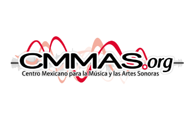
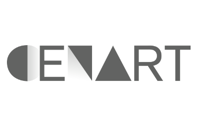
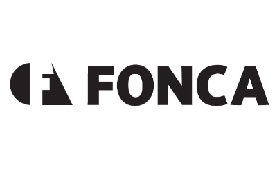

# musikkcontroller

musikkcontroller es software para interactuar desde tu teléfono o navegador con cualquier software que soporte OSC (MaxMSP,SuperCollider, ChucK, etc)

Solo necesitas especificar el puerto a enviar la información sobre OSC y escanea el código QR en tu teléfono para conectar.

Si lo deseas puedes ir a los contenidos dentro de la app buscar la carpeta web y modificar index.html para adecuar la interfaz a tus necesidades.

Internamente musikkcontroller crea un servidor para la interfaz web, despúes crea un puente para recibir mediante un WebSocket la información de la interfaz web y reenviarla mediante OSC al localhost del dispositivo por el puerto seleccionado.

### Contributors

### Built-in with the latest technologies

* Electron
* AntD
* osc-js
* NexusUI
* Express
